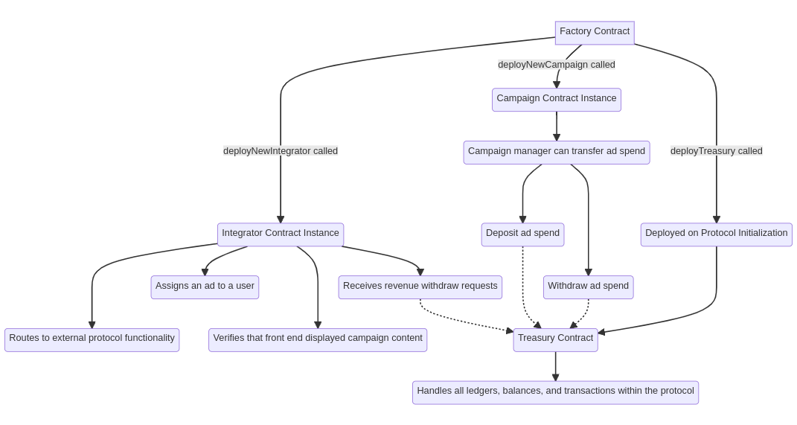
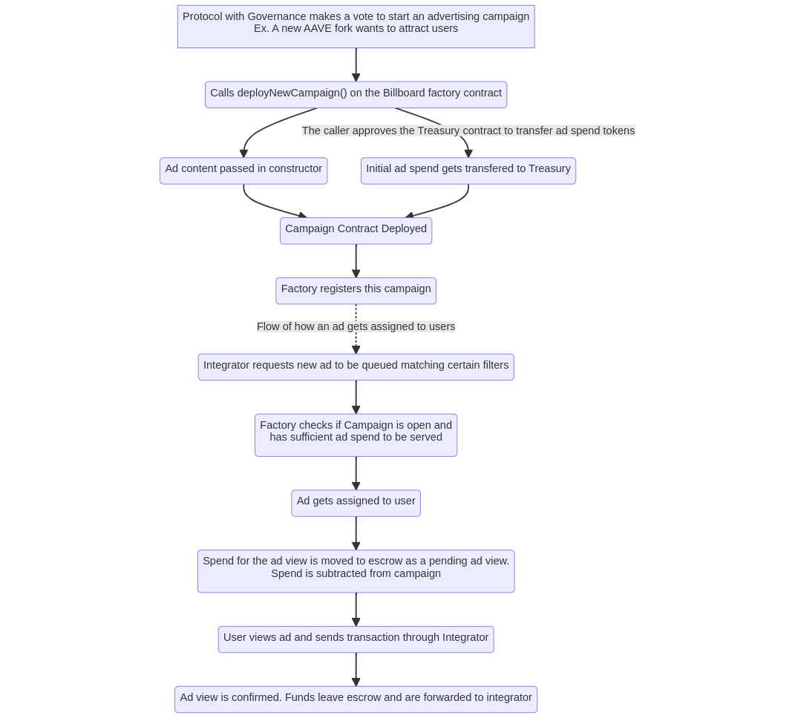
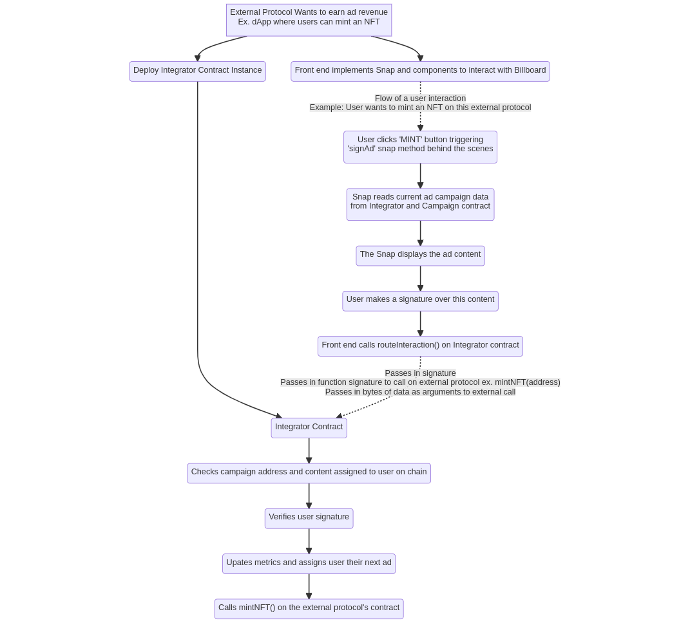

# BILLBOARD

Billboard is a decentralized advertising platform for DeFi protocols, DAOs, and other smart contract based entities. The platform utilizes Metamask Snaps, which are integrated into the user interface of dApps to enable protocols to earn revenue by displaying ads within Snaps, while also providing targeted marketing campaigns for decentralized protocols.

This platform introduces a new revenue stream and marketing strategies for protocols without the need for centralized elements. The Billboard Snap seamlessly integrates into existing UIs, showing the ad at the most engaging point of the UX flow without being obnoxious. The smart contract architecture was designed to be backwards compatible with most existing smart contracts.

Digital Marketing is a $500 billion dollar industry. As Web3 continues to grow, there is still a need for decentralized, scalable, abuse-resistant marketing protocols. Metamask Snaps provide the perfect environment to build this solution.

This project was developed for the Consensys NAVH Hackathon.

## REPO STRUCTURE

UI/next-app contains the next.js front end for the Campaigns/Integrators dashboard and the "MintNFT" example protocol front end
UI/snap contains the project for the Billboard snap

protocol-hardhat directory contains the solidity contract code and deployment environment for Hardhat
protocol-truffle directory contain the same solidity contract code and a Truffle deployment environment 

## TABLE OF CONTENTS 

## CONTRACTS

Here is a flowchart showing the main contracts and how they relate to each other

 

### Factory Contract

The Factory contract is a manager for deploying and registering the other contracts on the Billboard protocol. There are functions that can deploy new instances of contracts and assigning ad campaigns to users  

### Campaign Contract

Campaigns are contracts that hold content and metadata about an advertisement campaign. They are deployed through a factory contract and are designed to be creatable from other protocols. While the functionality is designed to be callable from external smart contracts or from within a Governance vote, anyone can call the factory deployNewCampaign() function and launch their own advertising campaign. Using filtering and categorization, this ad gets assigned to users and gets displayed when they interact with other dApps that enable Billboard for ad revenue. 

Currently, the ad content is limited to text format. However, a Snaps UI capable of  rendering images would serve a JPG ad saved on the contract as an IPFS URI. Also, Billboard plans to draft mrketing guidelines and outsource Campaign approval to a judgement protocol like UMA or Kleros to ensure that ad campaigns are appropriate and follow standards.

The revenue earned per ad view is currently hardcoded. One of the upcoming tasks is to futher develop a more dynamic bidding price system that accounts for more factors and filtering. For development purposes, ad spend is denominated and transacted in the Billboard Protocol token (BILL). In production, this will likely be changed to USDC/DAI.

Below is a flowchart demonstrating how a Campaign is launched and how it gets assigned to users



#### I want to start an advertising campaign. How does this work?

### Integrator Contract

An Integrator contract pertains to dApps looking to display ads as a revenue source. A dApp looking to implement Billboard ads will deploy a new instance of this Integrator contract. The Integrator acts as a middleware between the front end and the dApp’s on-chain functions. The Integrator contract verifies on chain that an ad was served using encryption.

Currently, this verification is made by a user making a signature on the front end over data served in the Billboard Snap. Potentially, with the keyring API it will be possible to build a closed circuit encryption system that proves that the user was served the ad and viewed it inside the snap. 

After performing verifications, the Integrator registers the ad view and then executes the call made to the external protocol, completing the original transaction that the user intended to make. The Integrator assigns the user a new ad to be viewed on their next interaction with the protocol. This contract is compatible with most existing smart contracts, opening up new business models and income streams for any protocol.

After registering ad views, the revenue is held in the Treasury contract and can be withdrawn by accounts approved by the Integrator deployer.

 

#### I want my dApp to earn ad revenue. How does this work?


### Treasury Contract

The Treasury contract handles the ledger and the entirety of token balances on the protocol. The ad spend/revenue mechanism is based on an escrow system. When an ad is queued to a user on an Integrator, the Treasury moves campaign 'spendPerDisplay' amount of ad spend to a "pending" ledger that makes both the Campaign and Integrator unable to withdraw. Once this user performs an interaction and confirms that the ad was viewed, these tokens become available to the Integrator. The Treasury handles all of the token transfers in and out of the protocol. Campaign ad spend deposits transfer the tokens to the Treasury contract. The tokens remain on this contract until they are withdrawn, either as Integrator revenue or revoked ad spend. In order to protect revenues/deposits from illegitimate withdraws, all withdraw recipients must be predefined.

## FRONT END

While Billboard itself does not need a front end, dApps looking to earn ad revenue need to integrate Billboard into their front end. After instantiating their Integrator contract, they have to install the Billboard Snap to display the ads and perfom verifications. There are three modifications to normal dApp transaction flow. Upon whatever behavior triggers the transaction call (button click, React event etc), implement the following steps:
- Insert the Snap trigger code snippet
- After the Snap executes and returns the `dataToSign` value, prompt the user to make a EIP-191 signature over this data
- Send the signature and the original, user intended function signature and arguments to the `routeInteraction()` function on your Integrator

Below is the Snap trigger code snippet mentioned above. This will connect UI elements to the RPC methods necessary to show the Snap.

```
const dataToSign = await window.ethereum.request({
    method: 'wallet_invokeSnap',
    params: { snapId: "npm:Billboard-Snap", request: { method: `signAd-${currentAddress}-${integratorAddress}` } },
});
```

As the development of Metamask Snaps continues progressing forwards, here are some features that will be included:
- Snap displays advertisement as an image, rather than just text format campaigns
- Possibly using the Keyring API to sign the ad content with the Snap for proof of view, making the verification system even more robust and abuse-resistant
- Prompting the user signature directly from the Snap, rather than passing data from the Snap through the frontend to be signed over.

Furthermore, the entire front end installation logic will be contained in a single React component, making integration as simple as importing a file.

### I am a dApp user. How will this affect my Web3 user experience?


### MintNFT

In order to further demonstrate how Billboard works and affects user experience, MintNFT was created as an example. This is a simple dApp where users can mint an NFT. MintNFT does not charge any fees, all of the revenue is earned from showing Billboard ads. Wanting their NFT, the user clicks the "MINT" button. This firstly triggers the Billboard Snap andshows the ad. The user copies the hash at the bottom of the Snap content and pastes it into the input. Then the  user is asked for a signature over that hash. After signing, MintNFT prompts a `routeInteraction()` call to their Integrator contract. Now MintNFT must pass the function signature of the method on their contract to execute whatever the user initially requested. In this case, the intended action is to call the `MintNFT(address)` function. This as a bytes4 function signature is `0x54ba0f27`. The address we want to pass as the argument is whatever destination address to receive the NFT, for this example it can be `0xf39Fd6e51aad88F6F4ce6aB8827279cffFb92266`. We pass the user signature, the function signature, and the bytes of function call data into `routeInteraction()`. The Integrator contract performs verifications, queues the user their next ad, allocates the earned ad revenue to the MintNFT protocol, and then executes `MintNFT(0xf39Fd6e51aad88F6F4ce6aB8827279cffFb92266)` on the MintNFT protocol contract. The user has their new NFT, and MintNFT has earned ad revenue.

## BOUNTIES

## NEXT STEPS AND FEEDBACK

## GLOSSARY

### Campaign
A Campaign is a Contract that holds content and metadata about an advertisement
### Integrator
An Integrator is a specific contract within the Billboard protocol designed to function as middleware for a dApp receiving ad revenue. This contract is responsible for recording ad metrics and executing verifications that originate from the frontend interface. An Integrator gets deployed for each protocol looking to serve ads
### External Protocol
This term describes a protocol that earns ad revenue by routing their contract interactions through an Integrator contract and implements the Billboard Snap on their front end
